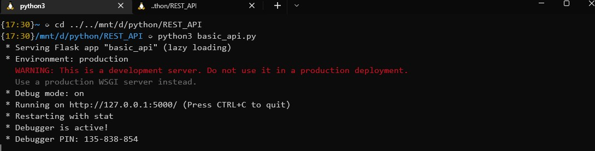
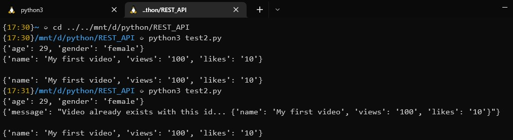
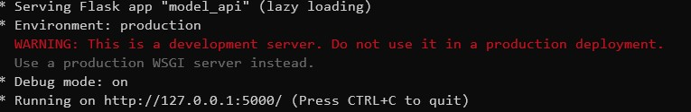
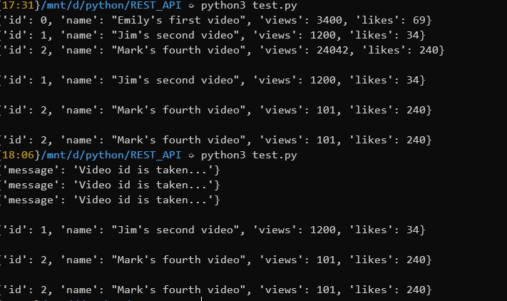

# REST API Practice

## Purpose of This Project

I wanted to get a better understanding of REST API using Python with Flask

## Basic API

The first program called [**basic_api.py**](basic_api.py) with the test code [test2.py](test2.py) has two classes one
called **HelloWorld** which takes in Resource import and just has a get function which just returns and json formatted
list of names. The other class is called **Video**, this class has two functions one being **get** and **put**. Get will
just receive the data when called in **test2.py** and put will create the data parameters to whatever they are set to.
If we wanted to just update/modify the data we would use **POST**

### Examples of Code Being ran

To run **basic_api.py**: `python3 basic_api.py` then this will be the output:

To run **test2.py**: `python3 test2.py` then this will be the output when ran twice:

You can see that we get the helloworld data for emily. Then we put the data in test2 into **video/0** then receive it 
using get. The second output shows how we stop/abort a situation when we try to create data that is already existed with
an ID.

## API Using a Model

In this program we take concepts learned in the [Basic Api](#Basic-API) section and apply it here using a class model
called **VideoModel** we use a couple of new imports **fields, marshal_with, and SQLAlchemy**. In our model we have an
id, name, views, and likes for a database column. Once our model is crated our class **Video** will now have **marshal
_with** before each function with *resource_fields* inside it; this will take the return value and json format it. 

We have the get and put functions as previously, but now we have a patch function which will update the data field.

### Examples of Code Being ran

To run **model_api.py**: `python3 model_api.py` then this will be the output:

To run **test.py** `python3 test.py` then this will be the output:

You can see from the test image that we have 3 IDs with data filled; we update video 2 with a new views number then we 
get that same data and see that is updated from before of a value of *24042*. You also see that we have a counter
measure in place again in that if a video id is taken we abort the put function call.